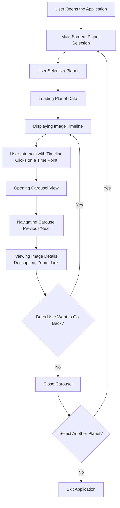

# DDD-2025-Group9
Giorgio Gaudio, Mattia Piatti, Elia Miglio

## Solar system perception

### Data Collection
- Where did you get your data from? [(https://api.nasa.gov) (https://www.mediawiki.org/w/api.php)] 
- What’s your data about? In what ways the perception of the solar system evolved over the course of human history, from ancient cosmologies to modern science (name,	persepton, data, who, 	how)
- Who is/are the sources/creators of your data? NASA and Wikipedia

### Data Organisation
- Have you combined data from different sources? How did you merge them?
- The final dataset was built by combining several heterogeneous sources: official databases from space agencies (ESA, NASA, Copernicus), institutional archives, historical documentation, and manually created tables used to fill missing information.
Wikipedia was consulted as an initial access point, but every piece of data was verified through primary sources or official documentation.
To merge everything into a coherent dataset, we carried out a structured process of data cleaning and data standardization:
Standardizing the columns (Assigned Name, Perception, Date, Author, Technique, Key Notes and Discoveries, Images).
Normalizing formats, with particular attention to dates, agencies, URLs, and time intervals.
Resolving inconsistencies between sources, removing duplicates, and unifying naming conventions.
Integrating all records into a single CSV/JSON file to ensure consistent readability and direct use within the interactive database.
This workflow ensured a consistent, readable dataset suitable for a visual and comparative project.

- What columns are more relevant for your project?
- The most essential columns for the project are:
Images
This is the core column. The project relies on comparative visualisation: the images allow users to observe how the planet has been represented, studied, or perceived across different historical periods. Without this column, the project would lose its visual and narrative foundation.
Perception
This column explains how each event or discovery influenced the cultural and scientific representation of the planet. It is useful for filtering, categorising, and relating images to one another, and it directly affects the user experience within the interface.
Description
It provides immediate context, clarifying what each image represents and allowing users to understand the logic behind each entry in the database. It is essential for clear interpretation, especially in an interactive visualisation where content must be quickly understandable.
These three columns form the main narrative structure: they connect each image to its meaning and to its historical-scientific context.

- Have you used any AI-based tool to understand or manipulate your data? if yes, what and how?

    We used an AI model (ChatGPT) as a support tool, not as a source for generating new data.
    Specifically:
    Data verification: AI was used to check historical consistency, mission dates, discoveries, scientists’ names, and to ensure that secondary sources aligned with primary sources.
    Image selection and validation: AI assisted in identifying official, reliable images sourced from appropriate archives with licences suitable for academic use.
    Dataset cleaning and reorganisation: AI supported the normalisation of categories, the generation of coherent concise descriptions, and the structuring of the dataset’s columns.
    AI was not used to generate scientific content but rather as a tool for review, organisation, and quality control of the dataset.

## Dataset
You can view the dataset [here](https://docs.google.com/spreadsheets/d/1KvleUGnZ65pnkitHW1Cpfbcoq9dREbgQBHVETdC4R2E/edit?gid=484108801#gid=484108801).

## Visualization
You can view the interactive visualization [here](https://solarsystem.mattiapiatti.eu).

## Block Diagram

